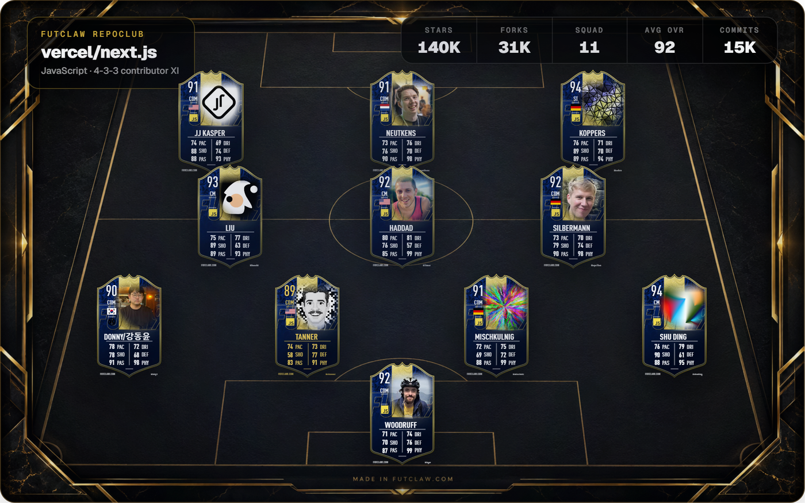

# FutClaw

Open-source developer cards, scout reports, and repo squads.

FutClaw turns public developer activity into shareable FUT-style identity cards. Generate a profile card, build a RepoClub Starting XI from any public repository, and share the result anywhere.

<p align="center">
  <a href="https://futclaw.com/repo/vercel/next.js">
    
  </a>
</p>

<p align="center">
  <strong>RepoClub</strong> turns any public repository into a contributor Starting XI.
</p>

## Features

- Generate developer cards from public GitHub profiles.
- Generate RepoClub squads from public GitHub repositories.
- Export cards and story-format images.
- Customize card name, country, overall, theme, and accent through URL/UI overrides.
- Browse recent community cards when Supabase is configured.
- Run locally or self-host with your own GitHub/Supabase/Redis credentials.

## Quick Start

```bash
npm install
npm run setup
npm run dev
```

Open `http://localhost:3000`.

`npm run setup` creates `.env.local` from `.env.example` if it does not exist. It never overwrites an existing `.env.local`.

## Environment

Live GitHub scouting requires at least one GitHub token:

```env
GITHUB_TOKEN=
```

For token pooling:

```env
GITHUB_TOKENS=token_one,token_two
```

Supabase and Redis are optional for local demos. Without them, FutClaw can still render sample/community fallback data and generate live cards when GitHub tokens are configured.

See `.env.example` for all supported variables.

## Routes

- `/` public generator
- `/[username]` public scout report
- `/u/[username]` canonical scout report implementation
- `/youtube/[username]` public YouTube card route
- `/[owner]/[repo]` RepoClub squad
- `/repo/[owner]/[repo]` legacy RepoClub squad route
- `/community` community browser
- `/community/[username]` community card detail
- `/api/card/[username]` JSON card API
- `/api/card-image/[username]` PNG card API

## Public URLs

Production cards are designed to live at stable URLs:

```md
[](https://futclaw.com/YOUR_USERNAME)
```

Use `?name=De%20Ruwe` to override the card display name without changing the GitHub username.

RepoClub squads use repository URLs:

```txt
https://futclaw.com/owner/repo
```

## Inspiration

FutClaw is inspired by [GitFut](https://github.com/Younesfdj/gitfut), the project that made GitHub profile cards feel instantly shareable. FutClaw extends that idea with RepoClub squads, story exports, community browsing, and deeper customization.

## Development

```bash
npm run lint
npm test
npm run build
```

## Security

Never commit `.env.local`, service role keys, GitHub tokens, Redis tokens, or analytics secrets.

Use SSH remotes for GitHub pushes:

```bash
git remote set-url origin git@github.com:YOUR_USER/YOUR_REPO.git
```

## License

MIT
